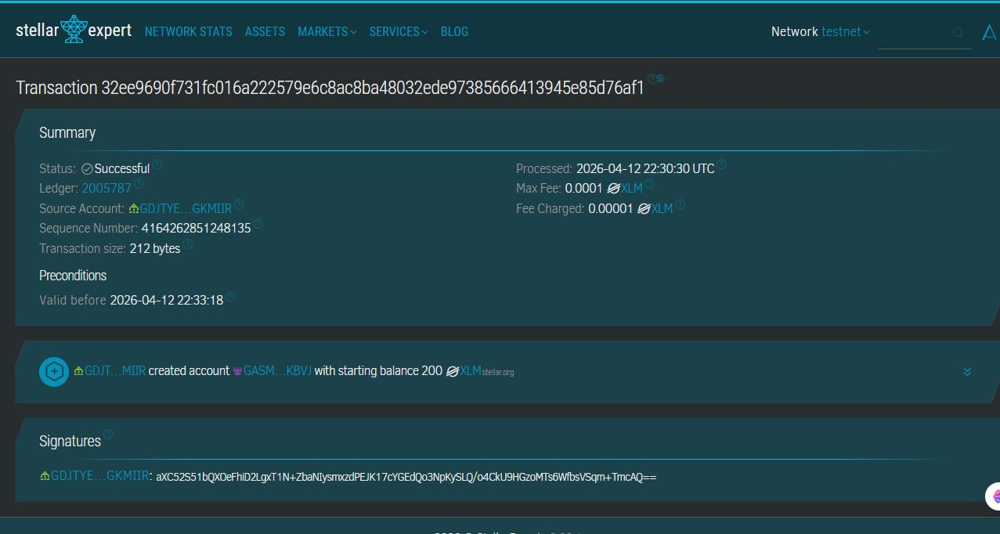
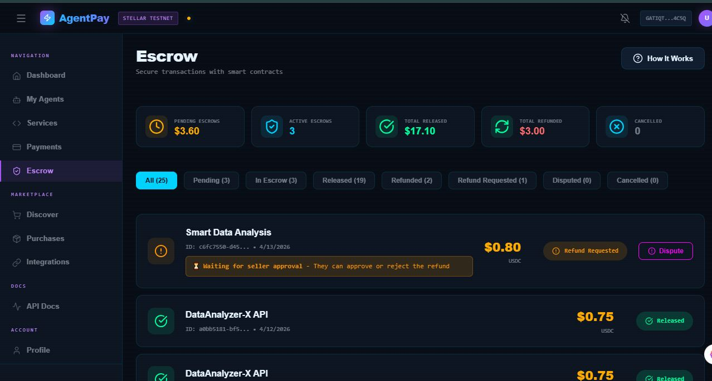
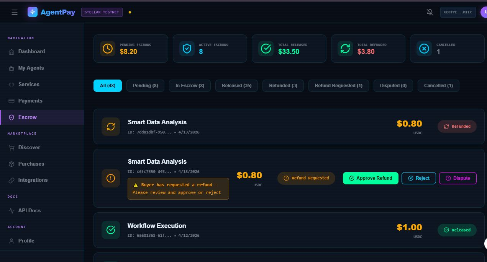

# Escrow Wallet Setup Guide

This guide explains how to set up Freighter wallet on Stellar testnet, fund it with test XLM, and configure the escrow wallet for AgentPay.

## Overview

AgentPay uses a true escrow mechanism on Stellar blockchain:

- **Buyer pays** → funds go to escrow wallet (funds actually leave buyer's account!)
- **Release** → escrow sends funds to seller
- **Refund** → escrow sends funds back to buyer

The escrow wallet needs XLM to process release/refund transactions.

---

## Part 1: Setting Up Freighter Wallet

### Step 1: Install Freighter

1. Visit https://www.freighter.app/
2. Download the browser extension (Chrome/Browser)
3. Install and open the extension

### Step 2: Create or Import Wallet

1. Click **"Add Wallet"** or **"Import Wallet"**
2. Choose:
   - **Create new** - generates a new keypair
   - **Import existing** - enter your existing secret key
3. Follow the setup wizard
4. Set a password to protect your wallet

### Step 3: Switch to Testnet

1. Click the **network indicator** in Freighter (usually shows "Public" or "Mainnet")
2. Select **"Testnet"**
3. The indicator should now show "Testnet" or "Test SDF Network"

---

## Part 2: Getting Testnet XLM

Stellar testnet provides free XLM for testing.

### Option A: Use Stellar Expert (Recommended)

1. Visit https://stellar.expert/
2. Make sure you're on **Testnet** (top right corner)
3. Click **"Claim Testnet Coins"** or navigate to account creation
4. Enter your Freighter public key (starts with G, M, or C)
5. Click **"Claim"** - you'll receive 10,000 test XLM

### Option B: Use Friendbot

1. Visit https://friendbot.stellar.org/
2. Enter your Freighter public key
3. Click **"Get Test Network XRP"** (actually XLM)
4. Wait for the transaction to complete

### Verify Your Balance

1. In Freighter, you should see your XLM balance
2. Or check on https://stellar.expert/ by searching your address

---

## Part 3: Understanding the Escrow System

### How It Works

The escrow wallet acts as a neutral middleman:

```
┌─────────────┐      XLM      ┌─────────────┐      XLM      ┌─────────────┐
│   BUYER     │ ────────────►│   ESCROW    │ ────────────►│   SELLER    │
│  (Freighter)│  "Buy Agent"  │   WALLET    │  "Release"   │  (Freighter) │
└─────────────┘               └─────────────┘              └─────────────┘
        │                                                      ▲
        │ "Refund"                                            │
        └──────────────────────────────────────────────────────┘
```

### Why Escrow Needs Funding

The escrow wallet must pay transaction fees when sending XLM during release/refund operations. Even though fees are tiny (0.00001 XLM), the account needs some XLM to function.

---

## Part 4: Funding the Escrow Wallet



### Current Escrow Address

The escrow wallet address for AgentPay is:

```
GASMUCKPCYZ5DGYO257VWLF5PEKGRNBWRNP2GILW2XXOTUXY3HQOKBVJ
```

### Steps to Fund

1. **Open Freighter** (ensure Testnet is selected)
2. Click **"Send"**
3. **Destination**: Paste the escrow address above
4. **Amount**: Send **2-5 XLM** (1 XLM creates the account if it doesn't exist, the rest is balance)
5. Click **"Send"** and confirm

**Note**: If Freighter says "Account doesn't exist" - that's normal! Just proceed. Sending 1+ XLM will create the account automatically.

### Verify Escrow is Funded

Check the escrow balance using the API:

```bash
curl http://localhost:3001/api/stellar/escrow/balance
```

Or view on https://stellar.expert/ by searching the escrow address.

---

## Part 5: Setting Up Your Own Escrow (Optional)

If you want to use your own escrow wallet instead of the default one:

### Generate a New Escrow Wallet

```javascript
const StellarSdk = require("@stellar/stellar-sdk");
const keypair = StellarSdk.Keypair.random();
console.log("Address:", keypair.publicKey());
console.log("Secret:", keypair.secret());
```

### Update Configuration

1. Open `AgentPay/apps/api/.env`
2. Update these values:

```env
ESCROW_WALLET=YOUR_NEW_PUBLIC_KEY
ESCROW_SECRET=YOUR_NEW_SECRET_KEY
```

3. Restart the API server
4. Fund the new escrow wallet with test XLM (2-5 XLM minimum)

---

## Part 6: Testing the Full Escrow Flow

Once escrow is funded, test the complete flow:

### 1. Buy an Agent (Lock Funds)

- Go to **Discover** tab
- Click **Buy** on any service
- Send XLM to the escrow wallet (funds leave your account!)
- Funds are now locked in escrow

### 2. Release Funds (Complete Purchase)

- Go to **Escrow** tab
- Find your escrow payment
- Click **Release**
- Funds go from escrow → seller ✅

### 3. Request Refund (Return Funds)



- Go to **Escrow** tab
- Find your escrow payment
- Click **Refund**
- (Seller approves the refund)



- Funds return from escrow → buyer ✅

---

## Troubleshooting

### "Invalid Stellar Address"

- Ensure the address starts with G, M, or C
- Copy the full address without spaces

### "Account Doesn't Exist"

- This is normal for new accounts
- Just send at least 1 XLM - it will create the account

### "Insufficient Balance"

- Make sure you have enough XLM in your Freighter
- You need extra XLM beyond what you're sending (for fees)

### Escrow Release Fails

- Verify escrow wallet has XLM balance (at least 1-2 XLM)
- Check API logs for error messages

---

## 🔐 Dispute System

### How Disputes Work

If a buyer requests a refund but the seller rejects it, the buyer can open a dispute. The dispute goes through the following flow:

```
┌─────────────┐      Refund      ┌─────────────┐      Approve      ┌─────────────┐
│   BUYER     │ ───────────────►│   SELLER    │ ◄─────────────────│   BUYER     │
│             │   "Not satisfied"│   Rejects   │   "No, I want      │             │
└─────────────┘                  └─────────────┘    my money back"  └─────────────┘
        │                                                                     │
        │                          Dispute Opened                             │
        │ ◄─────────────────────────────────────────────────────────────────────┘
        │
        │                                    ▼
        │                          ┌─────────────┐
        │                          │  ADMIN      │
        │                          │  Reviews    │
        │                          └─────────────┘
        │                                    │
        │              ┌────────────────────┼────────────────────┐
        │              │                    │                    │
        ▼              ▼                    ▼                    ▼
┌─────────────┐  ┌─────────────┐    ┌─────────────┐    ┌─────────────┐
│  AUTO-      │  │   Release   │    │   Refund    │    │   Manual    │
│  RESOLVE    │  │   to Seller │    │   to Buyer  │    │   Review    │
│  (24 hrs)   │  │             │    │             │    │             │
└─────────────┘  └─────────────┘    └─────────────┘    └─────────────┘
```

### Dispute Process

1. **Buyer requests refund** → Seller can approve or reject
2. **Seller rejects** → Buyer can open a dispute
3. **Dispute opened** → Admin panel shows dispute with timer
4. **Resolution options**:
   - **Release to Seller**: Funds go from escrow to seller
   - **Refund to Buyer**: Funds return from escrow to buyer
5. **Auto-resolve**: After 24 hours, disputes auto-resolve (funds released to seller)

### Important: Fair Resolution

To ensure fairness:

- **Buyer** can only resolve by releasing funds to the seller (can't refund to themselves)
- **Seller** can only resolve by refunding funds to the buyer (can't release to themselves)
- This prevents either party from unfairly resolving the dispute in their own favor

---

## Security Notes

⚠️ **Important**:

- The `ESCROW_SECRET` in `.env` controls the escrow wallet
- Never share your secret keys
- For production, use a hardware wallet or secure storage
- Testnet XLM has no real value - use only for testing
